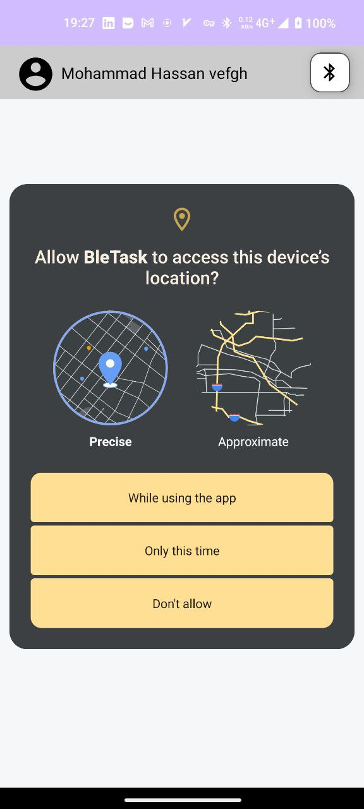
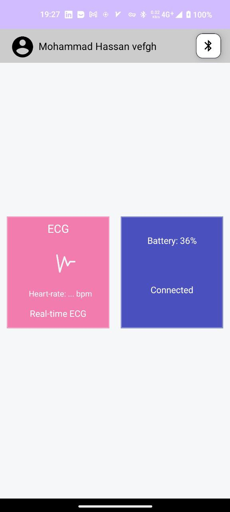
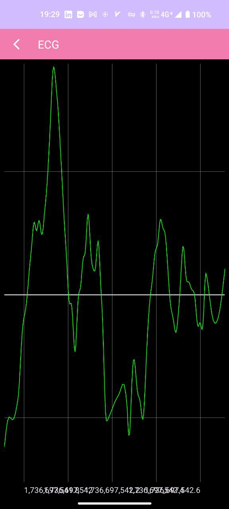
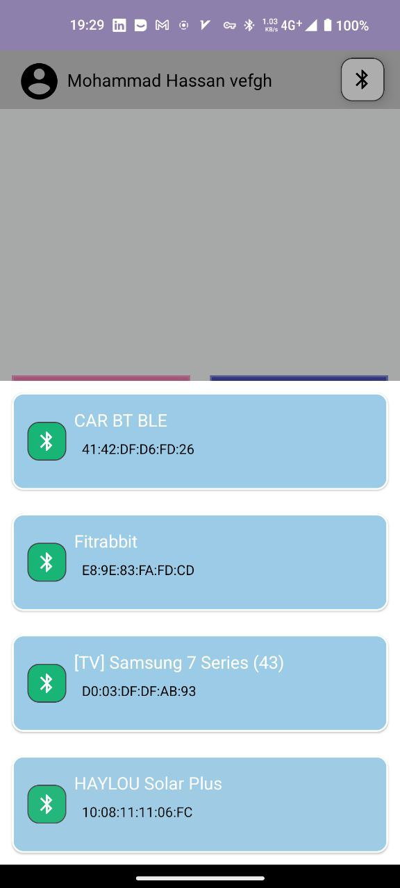

# BLE sample

<div style="display: flex; justify-content: space-between;">
  
  
</div>

<div style="display: flex; justify-content: space-between;">
  
  
</div>


## Tech Stack & Libraries Used

This project utilizes the following libraries:

### Dependency Injection
- **Hilt**: For managing dependency injection.
  - `libs.hilt.android`
  - `libs.hilt.compiler.v246`


### BLE (Bluetooth Low Energy)
- **Scanner**: For scanning BLE devices. (`libs.scanner`)
- **BLE Core**: Core functionalities for BLE support. (`libs.ble`)
- **BLE KTX**: Kotlin extensions for BLE. (`libs.ble.ktx`)
- **BLE Common**: Common utilities for BLE. (`libs.ble.common`)
- **BLE LiveData**: For integrating BLE with LiveData. (`libs.ble.livedata`)

### Navigation
- **AndroidX Navigation Component**: For handling in-app navigation.
  - `libs.androidx.navigation.fragment.ktx`
  - `libs.androidx.navigation.ui.ktx`

### Charts
- **MPAndroidChart**: For creating beautiful and interactive charts. (`libs.mpandroidchart`)
- **GraphView**: For visualizing data in graph format. (`libs.graphview`)

### Animations
- **Lottie**: For adding rich animations using JSON files. (`libs.lottie`)

### Coroutines
- **Kotlinx Coroutines**: For managing asynchronous programming.
  - `libs.kotlinx.coroutines.core`
  - `libs.kotlinx.coroutines.android`

## Installation

1. Clone the repository:
   ```bash
   git clone https://github.com/vefghmhassan/BleSample
2. Build the APK: Generate the APK file:
 ```bash
./gradlew assembleDebug

